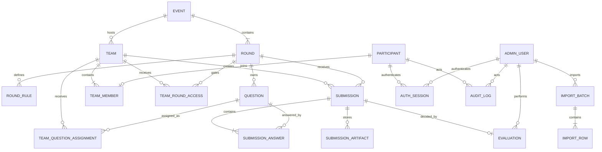

# PROMPTHON backend and database architecture audit

Date: 11 September 2026  
Scope: `Server/`, the frontend's data assumptions, and read-only inspection of the connected Supabase PostgreSQL database.

## Executive outcome

The repository previously had no application backend. `Server/` contained only a Prisma release-candidate package, a minimal config, and an empty schema. The frontend used hard-coded data, `localStorage`, `sessionStorage`, and artificial delays. The connected database contained Supabase-managed schemas only; no PROMPTHON tables or migration history existed.

This implementation establishes a modular Express API, a normalized Prisma data model, database-enforced invariants, opaque server sessions, participant and administrator authorization boundaries, live round control, qualification gating, four-question Round 1 submissions, evaluation, three-column Excel preview/commit, pagination, and append-only audit logging.

The live Supabase database was **not migrated**. The initial migration was validated inside a PostgreSQL transaction and rolled back.

## Discovery findings

### Existing server state

- No `src/`, controllers, routes, services, middleware, repositories, auth, tests, or API.
- No application models or migrations.
- Installed `prisma@8.0.0-rc.13` exposed the newer Prisma platform CLI rather than the stable ORM commands expected by the project.
- `.env` had database URLs, but the connection used PostgreSQL's privileged `postgres` role.
- The database had only Supabase-owned `auth`, `realtime`, `storage`, and `vault` objects.

### Frontend data dependencies found

- Participant admission by imported name and email.
- Email verification followed by a team-code gate.
- Teams of one to three members.
- Three sequential rounds; exactly one may be live.
- Round 1 has four assigned problem statements and four distinct public conversation links.
- Later rules and questions must remain hidden until that round is live and the team is eligible.
- A submitted round is locked until an administrator approves or rejects it.
- Approval is required for next-round eligibility; rejection remains locked out.
- Administrator dashboard, participant/team detail, submissions, round control, Excel import, and audit log.
- Leaderboard and score display.

### Critical pre-existing risks

| Severity | Finding | Resolution |
|---|---|---|
| Critical | Admin credentials were plaintext frontend constants. | Server-side bcrypt password hashes and HttpOnly sessions. |
| Critical | Participant/admin pages had no server authorization. | Separate `requireParticipant` and `requireAdmin` middleware. |
| Critical | Round and review state lived in each browser. | PostgreSQL is now the authoritative state store. |
| High | Concurrent admins could start multiple rounds or overwrite decisions. | Serializable transactions, a partial unique index, and optimistic versions. |
| High | Submissions could be edited after final submit. | Status transition checks and atomic lock timestamps. |
| High | Future-round rules/questions were only visually hidden. | API omits protected content unless both round and team access permit it. |
| High | No import provenance or validation history. | Import batch/row tables, preview validation, checksums, and commit audit. |
| High | Database credentials used a superuser. | Deployment requires separate migration and least-privilege runtime roles. |
| Medium | No request correlation or stable error contract. | Request IDs and standard response envelopes. |
| Medium | No retention or audit immutability. | Append-only audit trigger and documented cleanup policy. |

## Target architecture

```text
React frontend
  -> HTTPS /api/v1
  -> Helmet + CORS + trusted-origin guard + body limits + rate limits
  -> opaque session authentication
  -> participant/admin authorization middleware
  -> module route/controller
  -> domain service + transaction boundary
  -> Prisma Client + PostgreSQL driver adapter
  -> Supabase PostgreSQL

Future binary artifacts
  -> API-authorized signed upload/download
  -> private Supabase Storage bucket
  -> artifact metadata in PostgreSQL
```

The deployment unit is one modular monolith. Splitting services would add operational failure modes without solving a current scaling boundary. Modules are separated by auth, participant workflow, and admin control, while transactions remain local and reliable.

## Domain model



### Entity responsibilities

| Entity | Responsibility and lifecycle |
|---|---|
| `Event` | PROMPTHON occurrence, schedule, venue, and high-level state. |
| `Round` | Ordered competition stage with `LOCKED -> LIVE -> ENDED`, timestamps, and optimistic version. |
| `RoundRule` | Ordered rule text. Rules are returned only for the accessible live round. |
| `Participant` | Imported admitted person. Soft-deleted to preserve evidence and audit. |
| `Team` | Event-scoped Team Code identity. Soft-deleted when retired. |
| `TeamMember` | One participant-to-team membership. Participant membership is unique. |
| `TeamRoundAccess` | Per-team authorization and progress for a round. |
| `Question` | Versionable question bank item, including unpublished placeholders. |
| `TeamQuestionAssignment` | Stable assignment of a question and display position to a team. |
| `Submission` | One draft/final record per team and round with immutable final timestamps. |
| `SubmissionAnswer` | Evidence for one assigned question: URL, prompt, response, or notes. |
| `SubmissionArtifact` | Metadata for a private Storage object; never stores a public permanent URL. |
| `Evaluation` | One final approve/reject decision and optional score/feedback. |
| `AuthSession` | Hashed opaque session token for exactly one principal. |
| `ImportBatch` / `ImportRow` | Excel provenance, validation, idempotent commit outcome, and reconciliation. |
| `AuditLog` | Append-only security and business event journal. |

## Keys, relationships, and deletion behavior

- Application entities use database-generated UUID primary keys; audit rows use monotonic `bigint` keys for efficient cursor pagination.
- Participant email, event slug, team label/fingerprint, and session-token hash are unique.
- `TeamMember.participantId` is unique: one admitted person cannot silently join two teams.
- Team membership, submissions, evaluations, and competition history use `RESTRICT`; this prevents evidence loss.
- Rules, draft answers, import rows, sessions, and artifacts use scoped cascade only when their true owner is removed.
- Participant and team records use `deletedAt` rather than destructive deletion.
- Question removal is represented by `ARCHIVED`, not deletion.
- Evaluation and audit records are retained.

## Database-enforced invariants

The migration supplements Prisma with PostgreSQL constraints and triggers:

- Event end time is after start time.
- Round number is 1–3 and round windows are valid.
- A partial unique index permits at most one `LIVE` round per event.
- Rule/question/assignment positions are positive and unique within their scope.
- Participant and import emails must already be normalized lowercase values.
- Team codes and question content cannot be blank. Team Code is the sole team name and identity.
- Team size is limited to three by a transaction-scoped advisory-lock trigger, including concurrent joins.
- Submission timestamps must match draft/final status.
- A session belongs to exactly one participant or administrator.
- Evaluation scores are 0–100.
- Import counts cannot be negative or contradict the row totals.
- A submission answer must match its submission round and a question assigned to that team.
- `updatedAt` is database-authored for mutable entities.
- Audit rows cannot be updated or deleted.

Service validation remains necessary for clearer errors and multi-row workflow rules, but the database is the final authority for critical integrity.

## Index strategy

Indexes are based on observed access paths, not blanket indexing:

- `(eventId, status)` for round and team control screens.
- unique `(eventId, number)` for ordered round lookup.
- partial unique live-round index for the central concurrency invariant.
- `(roundId, status)` for qualification and review queues.
- `(roundId, status, submittedAt)` for submission administration.
- `(teamId, status)` for participant progress.
- `(roundId, questionId)` and team assignment uniques for evidence validation.
- `(expiresAt, revokedAt)` and principal/expiry indexes for session cleanup.
- batch/status and email indexes for import reconciliation.
- descending audit, actor, and entity indexes for append-heavy history queries.

Low-cardinality status columns are only indexed as part of real compound filters. Index cost should be revisited using `pg_stat_statements` after event traffic is available.

## Authentication and authorization

### Participant flow

1. Rate-limited email eligibility check.
2. Participant submits normalized email plus organizer-issued team access code.
3. Server uses an HMAC fingerprint for indexed lookup and bcrypt for credential verification.
4. An admitted unassigned participant joins the team transactionally; the database enforces the three-member maximum.
5. Server creates a random 256-bit session token, stores only its SHA-256 hash, and sends the raw token in an HttpOnly, SameSite=Strict cookie.

### Administrator flow

1. Admin submits email and password to the dedicated admin endpoint.
2. Password is verified against bcrypt; no default or frontend password exists.
3. An opaque admin session is issued.
4. Admin-only routes reject participant principals even if they have a valid session.

### Session policy

- Default lifetime: 12 hours, configurable up to seven days.
- Secure cookie is mandatory in production.
- Logout revokes the server session and clears the cookie.
- Disabled admins and suspended/disqualified participants cannot authenticate.
- Expired/revoked sessions are ignored and can be deleted by a scheduled cleanup job.
- Passwords, team codes, and cookies are redacted from request logs.

Fixed participant/admin roles are sufficient for the evidenced product. A permission junction model is intentionally not introduced until multiple administrator privilege tiers exist.

## Round, submission, and review state machines

```text
Round: LOCKED -> LIVE -> ENDED

Team access:
LOCKED -> ELIGIBLE -> IN_PROGRESS -> SUBMITTED -> APPROVED
                                         \-----> REJECTED

Submission:
DRAFT -> SUBMITTED -> UNDER_REVIEW -> APPROVED
                                  \-----> REJECTED
```

- Only the current `LIVE` round can accept drafts or final submission.
- A participant response contains no rules or questions for locked/rejected/future rounds.
- Round 1 requires exactly four assigned questions, one answer each, and four unique HTTP(S) conversation URLs.
- Final submit sets status, submit time, lock time, and team access in one serializable transaction.
- Review is allowed only after the round is `ENDED`.
- Evaluation is one final record per submission. A second decision returns a conflict instead of overwriting history.
- Starting Round 2 or 3 selects teams with `APPROVED` access in the immediately preceding round.

## Transaction and race-condition policy

| Workflow | Boundary and protection |
|---|---|
| Team join | Serializable transaction plus database advisory-lock trigger and unique participant membership. |
| Draft save | Serializable transaction; verifies live/access state and optional expected submission version. |
| Final submit | Serializable transaction; validates all assigned evidence and atomically locks submission/access. |
| Start round | Serializable transaction; optimistic round version plus database partial unique live index. |
| End/lock round | Optimistic versioned state update inside a transaction. |
| Admin review | Serializable transaction; expected submission version and unique evaluation. |
| Excel commit | Serializable, versioned batch; each row records imported/duplicate outcome. |

PostgreSQL serialization conflicts surface as HTTP 409 and are safe for clients to retry after refreshing. External email or Storage operations must not be placed inside these transactions; persist an outbox record first if such side effects are added.

## API contract

All routes are under `/api/v1`. Mutating browser requests must come from an allowed frontend origin.

| Method and path | Principal | Purpose |
|---|---|---|
| `GET /health/live` | Public | Process liveness; no database dependency. |
| `GET /health/ready` | Public | Database readiness. |
| `POST /auth/participant/verify-email` | Public/rate limited | Check admission before team-code step. |
| `POST /auth/participant/login` | Public/rate limited | Verify email/team code, join if needed, issue session. |
| `POST /auth/admin/login` | Public/rate limited | Verify administrator password and issue session. |
| `GET /auth/me` | Optional | Resolve current principal. |
| `POST /auth/logout` | Optional | Revoke session. |
| `GET /participant/overview` | Participant | Profile, team members, event, round progress. |
| `GET /participant/rounds` | Participant | Safe round shells and statuses. |
| `GET /participant/rounds/:number` | Participant | Accessible rules, assigned questions, and submission. |
| `PUT /participant/rounds/:number/submission` | Participant | Version-aware draft save. |
| `POST /participant/rounds/:number/submission/submit` | Participant | Validate and atomically lock final entry. |
| `GET /participant/leaderboard` | Participant | Aggregate evaluated scores for the event. |
| `GET /admin/dashboard` | Admin | Current event metrics and round summary. |
| `GET /admin/participants` | Admin | Filtered offset-paginated participant list. |
| `GET /admin/participants/:id` | Admin | Team, access, questions, evidence, and evaluations. |
| `GET /admin/submissions` | Admin | Review queue with filters and pagination. |
| `GET /admin/submissions/:id` | Admin | Complete evidence package. |
| `POST /admin/submissions/:id/review` | Admin | Final approve/reject with expected version. |
| `GET /admin/rounds` | Admin | Control state and counts. |
| `POST /admin/rounds/:id/start` | Admin | Start exactly one eligible round. |
| `POST /admin/rounds/:id/end` | Admin | End current live round. |
| `POST /admin/rounds/:id/lock` | Admin | Emergency/pre-event lock. |
| `GET/PUT /admin/rounds/:id/questions` | Admin | Inspect or replace the question set while not live. |
| `POST /admin/teams/generate` | Admin | Create strong codes; raw codes are returned once. |
| `POST /admin/imports/preview` | Admin | Validate a three-column `.xlsx` (`Name`, `Email`, `Team Code`) for the supplied `eventId` and persist preview provenance. |
| `POST /admin/imports/:id/commit` | Admin | Idempotent, versioned participant import. |
| `GET /admin/audit-logs` | Admin | Cursor-paginated audit stream. |

Success uses `{ data, meta? }`. Errors use `{ error: { code, message, details?, requestId } }`. Stable machine codes distinguish validation, auth, authorization, missing resource, stale version, and business conflict.

### Pagination decisions

- Participant/submission admin tables use `page` + `pageSize` because operators need stable page navigation and filtered counts.
- Audit history uses descending `bigint` cursor pagination because it is append-heavy and deep offsets would degrade.
- Default table page size is 25; maximum 100. Audit defaults to 50; maximum 100.

## Excel import model

- Only `.xlsx`, maximum 2 MiB and 1,000 participant rows.
- Column 1 is Name, column 2 is Email, and column 3 is Team Code. A `Name, Email, Team Code` header is optional.
- Names, emails, duplicate-in-file rows, and limits are validated before commit.
- Preview creates a checksum-addressed batch and row-level outcomes.
- Commit is versioned; repeating a committed request fails safely instead of duplicating data.
- Existing emails become `DUPLICATE`; new rows become `IMPORTED`.
- The import groups participants by Team Code and creates membership immediately. A code may contain at most three imported participants and is also the credential used at participant login.

## Supabase deployment design

### PostgreSQL

- `DATABASE_URL`: Supabase transaction/session pooler for normal API traffic.
- `DIRECT_URL`: direct endpoint for Prisma migration, introspection, and administrative tooling only.
- Create a least-privilege runtime role able to use the application tables/sequences but not create schemas, roles, extensions, or bypass row security.
- Keep a separate migration role; do not run the API as `postgres`.
- The browser must never receive database credentials or query these application tables directly.

Because Prisma is the trusted server data layer, application tables should revoke access from `anon` and `authenticated` unless a deliberate Supabase client use case is later added. If direct client access is introduced, enable RLS first and write policies based on trusted JWT claims—never client-supplied team IDs.

### Storage

`SubmissionArtifact` is ready for a private bucket. Recommended bucket: `submission-artifacts`; recommended key:

```text
events/{eventId}/teams/{teamId}/submissions/{submissionId}/{randomUuid}-{sanitizedName}
```

- Keep the bucket private.
- Authorize every upload/download through the API.
- Use short-lived signed URLs, MIME allowlists, byte limits, SHA-256 checksums, and random object names.
- Store bucket/path, not a permanent public URL.
- A background cleanup must remove objects only after the related database record is safely retired.

The Storage transport is not enabled yet because no Supabase service credential or final Round 3 upload contract was supplied. The relational metadata and security boundary are in place.

## Security controls implemented

- Helmet headers and disabled framework banner.
- Explicit credentialed CORS allowlist.
- Trusted-origin check on all state-changing requests.
- Small JSON/form limits and a 2 MiB Excel limit.
- Rate limits on public authentication endpoints.
- Zod body/query validation.
- HttpOnly, Secure-in-production, SameSite=Strict sessions.
- Hashed session tokens and bcrypt admin passwords. Team Code is intentionally stored as the public team identity and verified together with the admitted participant email.
- Separate admin and participant route guards.
- Generic credential errors to reduce account enumeration.
- Pino redaction for cookies/password/team codes.
- Request IDs in logs and error responses.
- No raw secrets or database URLs in code or documentation.
- Append-only security audit.

Recommended additions before public launch: reverse-proxy TLS, WAF/edge rate limits, managed secret rotation, CSP tuning against the deployed frontend, automated session cleanup, database backups with restore drills, and monitoring on repeated login failures and round-control conflicts.

## Migration and rollout strategy

1. Back up the target project and verify restore access.
2. Create dedicated migration/runtime roles and rotate the current privileged application credential.
3. Review `prisma/migrations/20260911000100_initial_architecture/migration.sql`.
4. Run `npm run prisma:validate` and `npm run prisma:generate` in CI.
5. Apply with `npm run prisma:migrate:deploy` using `DIRECT_URL` during a controlled deployment.
6. Run `npm run prisma:seed`; provide a strong one-time admin password only in the deployment environment.
7. Generate teams and distribute access codes securely. Codes are only returned once.
8. Replace and publish the four real Round 1 questions. Placeholder questions are deliberately `DRAFT`, so Round 1 cannot start accidentally.
9. Connect frontend API calls and remove mock/local-storage authority.
10. Smoke-test auth, import, team join, round start, four-answer submission, end, review, and Round 2 eligibility.
11. Monitor connection usage, slow queries, conflicts, and audit events.

Rollback is migration-specific. For this initial empty application schema, do not improvise a destructive rollback after live data exists. Prefer forward fixes and restore rehearsals.

## Data retention and cleanup

- Sessions: delete expired/revoked records after 30 days.
- Failed/preview-only import batches: retain 90 days for reconciliation, then delete batches and rows under a documented job.
- Audit logs: retain for at least one competition cycle plus the institution's required review period; archive rather than mutate.
- Submissions/evaluations: retain as official event evidence according to college policy.
- Participant PII: soft-delete operational access, then anonymize only under an approved retention request that preserves aggregate results and audit integrity.
- Storage artifacts: lifecycle follows submission retention; never orphan-delete without a database check.

## Implementation status and gaps

### Completed

- Stable Prisma ORM 7 toolchain and PostgreSQL adapter.
- Normalized schema with keys, relations, enums, checks, indexes, triggers, timestamps, and soft deletion.
- Initial migration generated and transactionally validated against PostgreSQL.
- Express API shell, configuration validation, logging, security middleware, auth, and role guards.
- Participant gating, round visibility, four-question evidence, draft/final submission.
- Admin dashboard queries, participant/submission details, review decisions, round controls, questions, teams, Excel import, and audit history.
- Seed data for event, three rounds, concise rules, unpublished placeholders, and optional admin bootstrap.
- Typecheck, build, unit/API-shell tests, and dependency audit.

### Deliberately not performed

- No migration was applied to the live Supabase project.
- Existing frontend mock services were not replaced; doing so is a separate integration change with visible behavior and environment configuration.
- No production admin credential was invented or printed.
- No Supabase Storage service credential was requested or stored.
- No email delivery system was introduced; organizer code distribution remains operational.

### Next integration work

1. Add a typed frontend API client with `credentials: "include"`.
2. Replace mock email/team-code and admin login functions.
3. Replace localStorage round control and submission progress with API state.
4. Add route-loading/error states and invalidate queries after admin transitions.
5. Add signed Storage flows when Round 3's final artifact fields are confirmed.
6. Add full integration tests against a disposable PostgreSQL database in CI.

## Validation evidence

- `prisma validate`: passed.
- Prisma Client generation: passed.
- TypeScript typecheck: passed.
- Production build: passed.
- Vitest: 2 files, 6 tests passed.
- `npm audit --omit=dev`: 0 vulnerabilities after safe transitive overrides.
- Initial migration: all DDL succeeded in PostgreSQL inside a transaction; transaction rolled back.
- Live database reinspection should be performed immediately before deployment to detect external schema changes.
